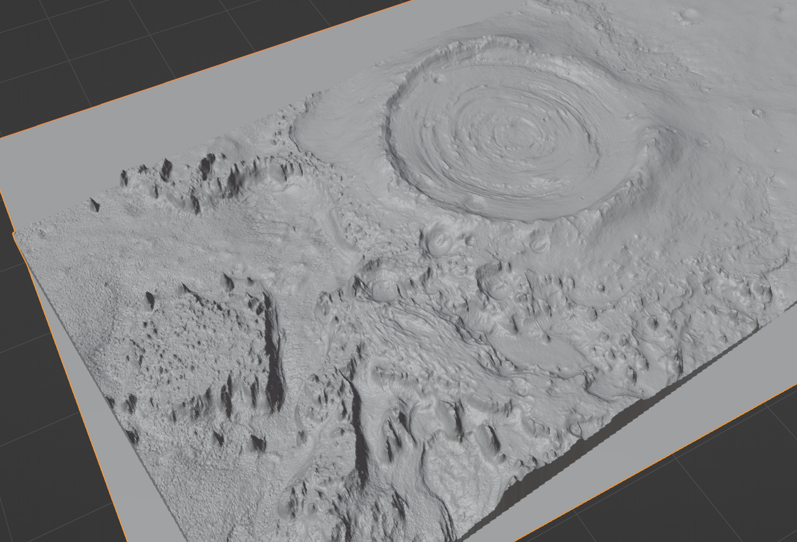

# Planetary Data System (PDS) Digital Terrain Model (DTM) Importer for Blender

This is the source code for an add-on that creates a mesh from a Planetary Data System (PDS) Digital Terrain Model (DTM) .img file. This add-on contains all libraries as direct imports, simplifying the install process, and provides a handy file menu for easy access.

## What is a DTM
A DTM is a high-resolution elevation map of a geographic area that has been generated from a pair of images that have been taken from two slightly different vantage points. Think of how your eyes perceive depth. It's the same idea. A DTM is typically much higher resolution than other methods, but covers a relatively small area. 

There are several space missions that use PDS-formatted IMG files to encode digital terrain models. Two notable missions are HIRISE, which is an instrument on the Mars Reconnaissance Orbiter that images Mars, and the Lunar Reconnaissance Orbiter Camera (LROC), which images the moon on (surprise) the Lunar Reconnaissance Orbiter.

## HIRISE
[HIRISE](https://www.uahirise.org/) (High Resolution Imaging Science Experiment) is the most powerful camera ever sent to another planet, one of six instruments onboard the Mars Reconnaissance Orbiter. There are several data products derived from the instrument, the one we want to use is the "Digital Terrain Model" or DTM.

> HiRISE DTMs are made from two images of the same area on the ground, taken from different look angles. Creating a DTM is complicated and involves sophisticated software and a lot of time, both computing time and human operator time.  The great advantage of a HiRISE DTM is the high resolution of the source images. As a general guide, terrain can be derived at a post spacing about 4 times the pixel scale of the input images. HiRISE images are usually 0.25 - 0.5 m/pixel, so the post spacing is 1-2 m with vertical precision in the tens of centimeters.  
[source](https://www.uahirise.org/dtm/about.php)

HIRISE DTMs can be found [here](https://www.uahirise.org/dtm/).

## LROC
In operation since 2009, the Lunar Reconnaissance Orbiter Camera (LROC) is a system of three cameras mounted on the Lunar Reconnaissance Orbiter (LRO) that capture high resolution photos of the lunar surface.

I recommend starting with the [Wide Angle Camera (WAC) Color Shaded Maps](https://wms.lroc.asu.edu/lroc/view_rdr/WAC_CSHADE), which provide a global view of the moon.

### Other Sources

In theory you can use this addon to import any Planetary Data System (PDS) IMG file. If you run into any problems, open an issue and be sure to link the file you were trying to open and I will try to take a look.

## Installation
Download the .zip from the [releases](https://github.com/dcellucci/hirise-blender/releases/) and install as you would a [typical Blender add-on](https://docs.blender.org/manual/en/latest/editors/preferences/addons.html#installing-add-ons)

### Testing
Find yourself a cool, mega-detailed DTM file and download it (I like [this one](https://www.uahirise.org/dtm/PSP_001981_1825))

Select `File -> Import -> PDS .IMG` and select your file. 

### Enjoy

Enjoy your new detailed mesh of Mars!

## Import Options
There are a few options to note

### Pixels Per Grid Square
This effectively downsamples the original IMG file when creating the mesh. A single grid square in the mesh will correspond to this many pixels in the original data.

Note that this will directly relate to import time and memory usage. **Going below 4 PPGS might cause a memory error so that's why we have the safety option below**

### Safety
You must check the safety box if you select a PPGS below 4. This is for the best. 

### Quads
Select quads or tris for the mesh face. Defaults to quads.

## Acknowledgements
This work builds on the excellent efforts of the [planetarypy](https://github.com/planetarypy) team, who produced the `planetaryimage` and `pvl` packages that are statically linked here.